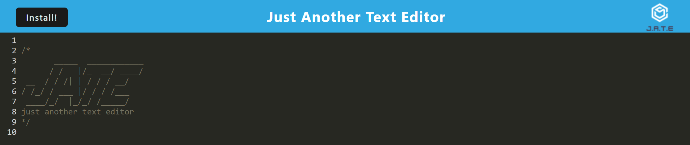
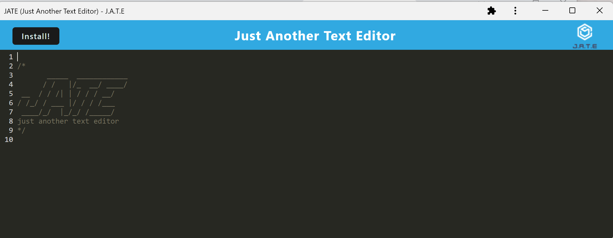

# **text-editor**

> This repository utilizes Progressive Web Applications and WebPacks to create a text-editor that functions both on the browser as well as asynchronously offline. It does so through service workers, localStore, and IndexDB. 

## **Table of Contents**

- [**text-editor**](#text-editor)
  - [**Table of Contents**](#table-of-contents)
  - [**Features**](#features)
  - [**Installation**](#installation)
  - [**Usage Instructions**](#usage-instructions)
  - [Questions](#questions)
  - [Credits](#credits)

## **Features**
The deployed application and repository focuses largely on back-end server-side structures, particularly within the realm of Progressive Web Applications:

- Javascript on client-side creates local instance of database to function and store data offline, and defines logic for operating offline.
- Webpack configurations provide more information on the Progressive Web Application and metadata.
- Allows for the installation of the application to function offline.

## **Installation**

Copy the HTTPS or SSH key into your terminal and perform a git pull to create a local copy of the repository. A copy of this repository can be cloned using either of the following codes in the terminal to create a copy in your local environment:

**HTTPS**: 
> `https://github.com/christiangella/text-editor.git`

**SSH**:
> `git@github.com:christiangella/text-editor.git`

## **Usage Instructions**

To deploy the application from your local environment, first clone a copy of the repository. Once the repository has been downloaded, navigate to the repository in the terminal and install the necessary third-party packages using `npm i` or `npm install`. The package.json defines that node package module installation will proceed for both back-end and client-side.

In the command line terminal, deploy the application locally by running either `npm start`. This will deploy the repository to your local host at http://localhost:3000/, and run both the back-end and client-side server. The text-editor can be accessed offline by clicking the install button.

To deploy to Heroku, open the repository in the terminal and run `npm i heroku`. Log into your Heroku using `heroku login` and perform a `git init` to initialize the repository. Add the files by using `git add -A`, and then use `git commit -m "{comment}"` to commit the files. Input `heroku create` if you do not have a Heroku deployment available. Run `git push heroku main` to deploy from the main branch..

## Questions

This repository was created by Manong Chris. For further support, reach out by email at christian.gella@gmail.com or by Github at christiangella.

## Credits

This repository was developed for the UC Davis Fullstacks Bootcamp under the UC Davis Continuing and Professional Education.
